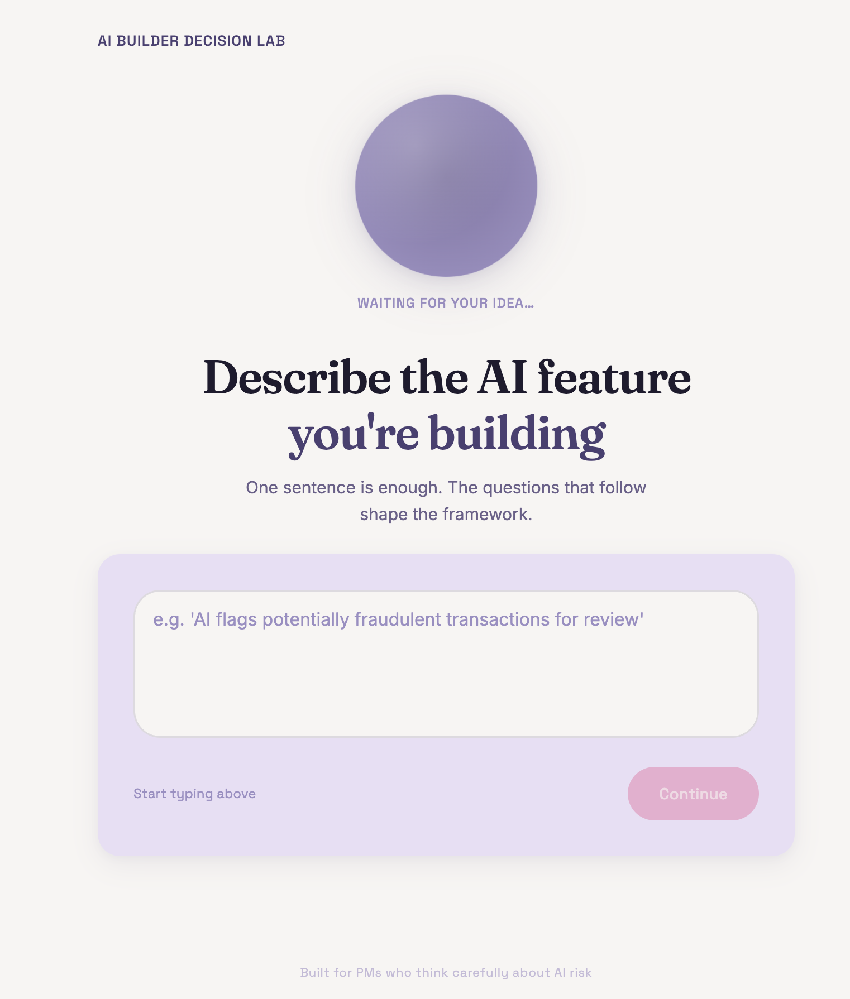
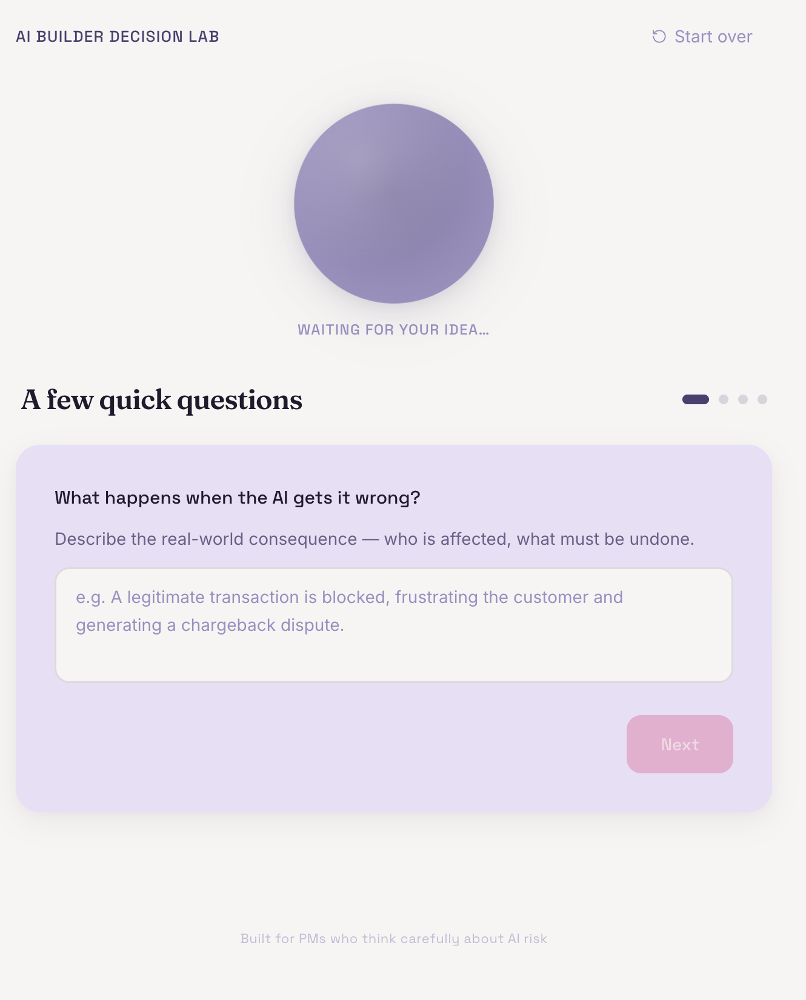
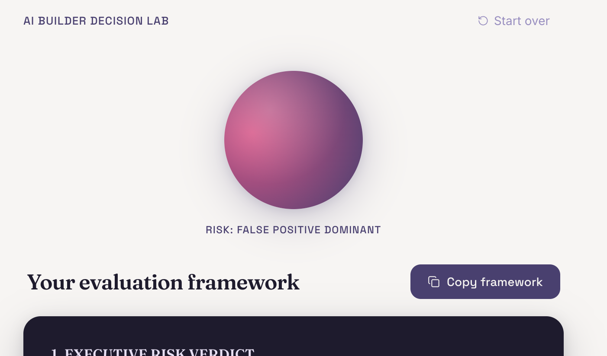

# AI Builder Decision Lab

A tool that turns a rough AI feature idea into an engineering-ready evaluation framework - covering error tolerance, risk asymmetry, human-in-the-loop design, feasibility, and team requirements — in under 60 seconds.

Built as a portfolio project to demonstrate AI product judgment, not just AI tool usage.

**[Live Demo →](https://ai-builder-decision-lab.vercel.app/)**

---

## Screenshots

| Input | Questions | Output |
|-------|-----------|--------|
|  |  |  |

---

## What It Does

Describe an AI feature you're considering building. Answer four targeted questions about error consequences, risk asymmetry, human review requirements, and stakeholder level. Generate a seven-section implementation-ready evaluation framework that a real PM would hand to an engineering lead.

### Output sections:
1. Executive Risk Verdict
2. Error Tolerance Analysis (with ASCII flow diagram + quantitative thresholds)
3. Risk Asymmetry Playbook (False Positive vs. False Negative suppression tactics)
4. Human-in-the-Loop Guardrails
5. Pre-Ship Evaluation Checklist
6. Feasibility Assessment (complexity, effort, recommended build approach per component)
7. Team & Assets Needed (roles, responsibilities, squad composition)

---

## Why I Built This

AI teams often move directly from feature ideas to implementation without explicitly defining what "wrong" looks like, who reviews edge cases, or how to measure trust in the model's output. This tool operationalizes that judgment into a repeatable artifact.

The question bank is drawn from real evaluation-framework work: The framework draws on the evaluation approach I used while partnering with Data Science and Behavioral Science to improve sentiment analysis accuracy by 25% and operationalize human-in-the-loop review processes for a production AI consumer product.

---

## Design Philosophy

I believe good AI products aren't defined by model quality alone; they're defined by the quality of the decisions surrounding them.

This project explores the questions product teams should answer before implementation begins: what happens when the model is wrong, where humans should stay involved, and how trust should be earned over time.

---
## Tech Stack

- **Framework:** Next.js 16 (App Router, TypeScript)
- **AI:** Google Gemini API (gemini-3.5-flash)
- **Styling:** Tailwind CSS + @tailwindcss/typography
- **Rendering:** react-markdown
- **Fonts:** Fraunces (display), Inter (body), Space Grotesk (labels)
- **Deployment:** Vercel

---

## Running Locally

**Prerequisites:** Node.js >= 20.9.0

1. Clone the repo:
git clone https://github.com/your-username/ai-builder-decision-lab.git
cd ai-builder-decision-lab

2. Install dependencies:
npm install

3. Create a `.env.local` file in the project root:
GEMINI_API_KEY=your_key_here
Get a free API key at [aistudio.google.com](https://aistudio.google.com)

4. Start the dev server:
npm run dev

5. Open [http://localhost:3000](http://localhost:3000)

---

## Project Structure

```
src/
├── app/
│   ├── api/generate/route.ts   # Server-side Gemini API call + prompt logic
│   ├── page.tsx                # Main app state + phase management
│   └── globals.css             # Global styles
├── components/
│   ├── screens/                # InputScreen, QuestionsScreen, LoadingScreen, OutputScreen
│   ├── questions/              # Q1–Q4 question components
│   └── RiskOrb.tsx             # Animated risk visualization
└── lib/
    ├── generateFramework.ts    # Framework generation (legacy placeholder)
    └── types.ts                # Shared TypeScript types
```
---

## The Question Bank

The four questions the tool asks are deliberately chosen — not generic:

1. **Error Consequence** — What actually happens when this AI is wrong?
2. **Cost Asymmetry** — Which is worse: a false positive or a false negative?
3. **Human-in-the-Loop** — Where does a human need to stay in the review loop?
4. **Stakes Level** — How high are the consequences if this ships with flawed logic?

These map directly to the judgment calls that separate a well-designed AI feature from one that erodes user trust on first failure.

---

## Future Improvements

Given additional time, I'd expand the framework to:

- Recommend rollout strategies (shadow mode, phased rollout, feature flags)
- Generate experiment hypotheses and success metrics
- Incorporate regulatory and privacy considerations
- Produce downloadable PRDs and risk registers
- Learn from previous evaluations to improve recommendations over time
---

## About

Built by [Lyric Smith](https://www.linkedin.com/in/lyricsmith1) — AI Product Manager focused on consumer experiences, activation, and translating emerging AI capabilities into trustworthy user value.
